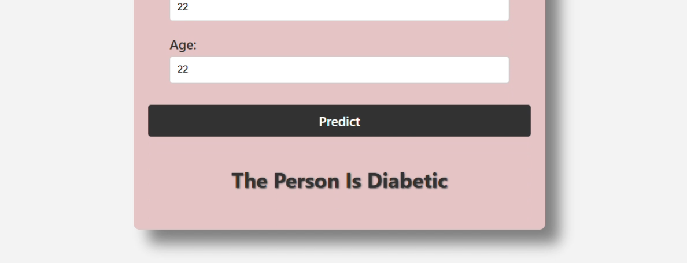
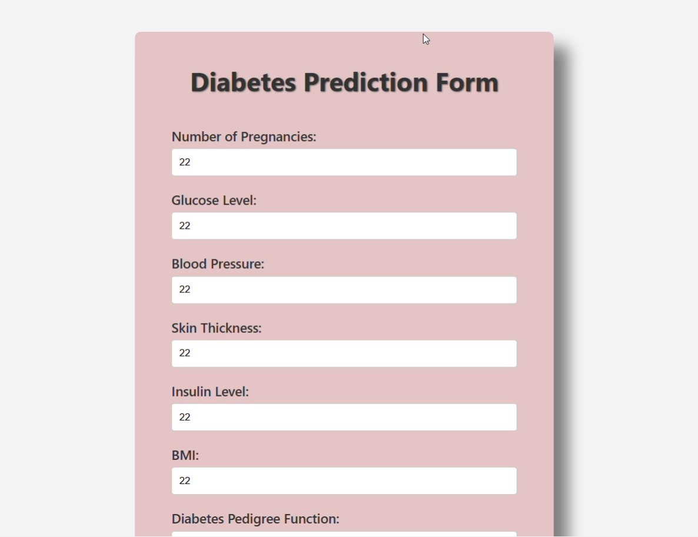

# Diabetes Prediction System

## Table of Contents

- Features
- Technologies Used
- Usage
- Example
- File Structure
- Screenshots
- Contributing

## Features

- **Diabetes Prediction**: Predicts whether a person is diabetic or not based on user input.
- **Interactive User Input**: Allows users to provide data such as glucose levels, BMI, blood pressure, etc., for real-time predictions.
- **SVM Classifier**: The model is built using a Support Vector Machine classifier.
- **Model Evaluation**: The model’s accuracy is evaluated on both training and test datasets.
- **Web Interface**: A user-friendly web interface built with HTML, CSS, and JavaScript for entering data and displaying predictions.

## Technologies Used

- **Python 3.x**: Programming language.
- **Flask**: For creating the web application.
- **scikit-learn**: For building and evaluating the machine learning model.
- **pandas**: For data manipulation and handling the dataset.
- **numpy**: For numerical operations.
- **StandardScaler**: For standardizing the input features.
- **HTML/CSS/JavaScript**: For creating the web interface.

## Usage

### How to Use

1. **Clone the repository**:
    ```bash
    git clone https://github.com/Tusharr06/Diabetes-Prediction-System.git
    cd Diabetes-Prediction-System
    ```
2. **Install Dependencies**:
    Install the required Python packages using pip:
    ```bash
    pip install -r requirements.txt
    ```

    Alternatively, you can install the dependencies manually:
    ```bash
    pip install pandas numpy scikit-learn flask
    ```
3. **Run the Application**:
    Execute the Flask application:
    ```bash
    python app.py
    ```
4. **Open the Web Application**:
    Open your web browser and go to `http://127.0.0.1:5000/`.

5. **Enter User Data**:
    Use the web form to enter the following health-related information:
    - Number of pregnancies
    - Glucose level
    - Blood pressure
    - Skin thickness
    - Insulin level
    - BMI (Body Mass Index)
    - Diabetes Pedigree Function (DPF)
    - Age

6. **Get the Prediction**:
    After entering the data, click the "Predict" button to see the prediction result.

### Example

Here are some example values you can use to test the form:

- **Number of Pregnancies**: 3
- **Glucose Level**: 150
- **Blood Pressure**: 85
- **Skin Thickness**: 30
- **Insulin Level**: 130
- **BMI**: 32.0
- **Diabetes Pedigree Function**: 0.8
- **Age**: 50

After entering these values, the model will predict whether the person is diabetic or not.

## File Structure

- `app.py`: The main Flask application file.
- `templates/index.html`: The HTML file for the web interface.
- `static/styles.css`: The CSS file for styling the web interface.
- `static/script.js`: The JavaScript file for handling form submission and displaying results.

## Screenshots





## Contributing

If you would like to contribute to this project, please fork the repository and submit a pull request. For major changes, please open an issue first to discuss what you would like to change.
